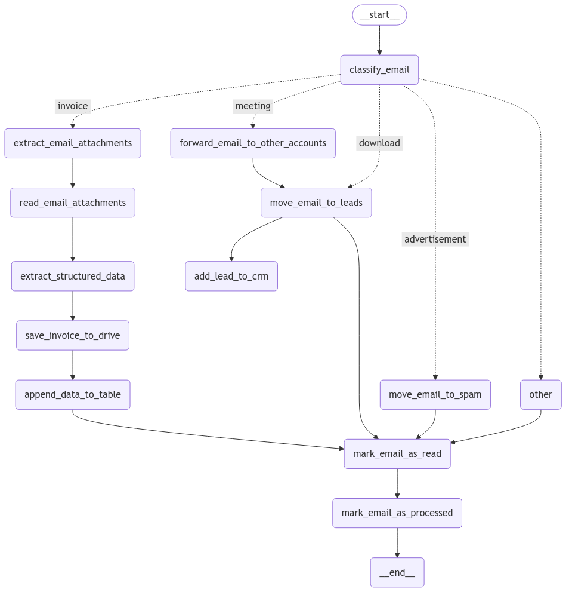

# Personal E-Mail Assistant
This repository is a workflow for automatically categorizing and processing emails from an Outlook E-Mail inbox.

## Workflow

## Getting Started

### Prerequisites
- Python 3.9 installed
- pip package manager installed

### Setup
1. Clone the repository.
2. Copy the `env.template` file and rename it to `.venv`.
3. Add your credentials. Credentials can be found on [entra.microsoft.com](https://entra.microsoft.com) in the Home tab and within your Enterprise Application.
4. Run `pip install -r requirements.txt`.
5. Run `assistant.py`.

### Microsoft Authentication Setup
1. Log in to [entra.microsoft.com](https://entra.microsoft.com).
2. Navigate to Applications > Enterprise applications > New application > Create your own application. Enter the application name and select "Register an application to integrate with Microsoft Entra ID (App you're developing)".
3. In your application, go to "API permissions" and add "Application.Read.All" and "Mail.Read" from Microsoft Graph. Grant admin consent for both permissions.
4. In your application, go to "Certificates & secrets" and add a new client secret. Add the value to the `.env` file as `AZURE_CLIENT_SECRET`.
