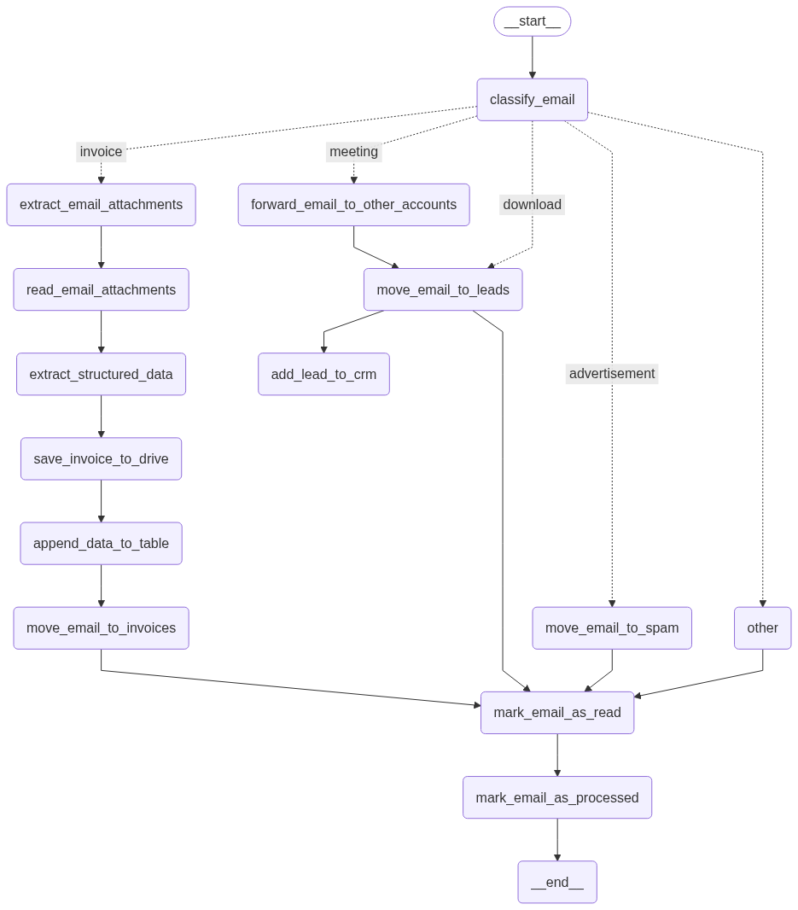

# Personal E-Mail Assistant
This repository provides a workflow for automatically categorizing and processing emails from an Outlook inbox.

## Workflow

## Getting Started

### Prerequisites
- Python 3.9
- pip package manager

### Setup
1. Clone the repository.
2. Copy the `env.template` file and rename it to `.env`.
3. Add your credentials from [Microsoft Entra](https://entra.microsoft.com) in the Home tab and within your Enterprise Application.
4. Run `pip install -r requirements.txt`.
5. Execute `assistant.py`.

### Microsoft Authentication Setup
1. Log in to [Microsoft Entra](https://entra.microsoft.com).
2. Navigate to Applications > Enterprise applications > New application > Create your own application. Enter the application name and select "Register an application to integrate with Microsoft Entra ID (App you're developing)".
3. In your application, go to "API permissions" and add "Application.Read.All" and "Mail.Read" from Microsoft Graph. Grant admin consent for both permissions.
4. In your application, go to "Certificates & secrets" and add a new client secret. Add the value to the `.env` file as `AZURE_CLIENT_SECRET`.

### Google Vision AI Setup
1. Go to the Google Cloud Console.
2. Navigate to IAM & Admin > Service Accounts.
3. Create a new service account or use an existing one.
4. Assign the necessary roles (e.g., Cloud Vision API User).
5. Generate a JSON key file, download it, and place it in this project as `keys/google-credentials.json`.

### Google Docs Setup
1. Create the table for expenditure
2. Share wit with your google service account